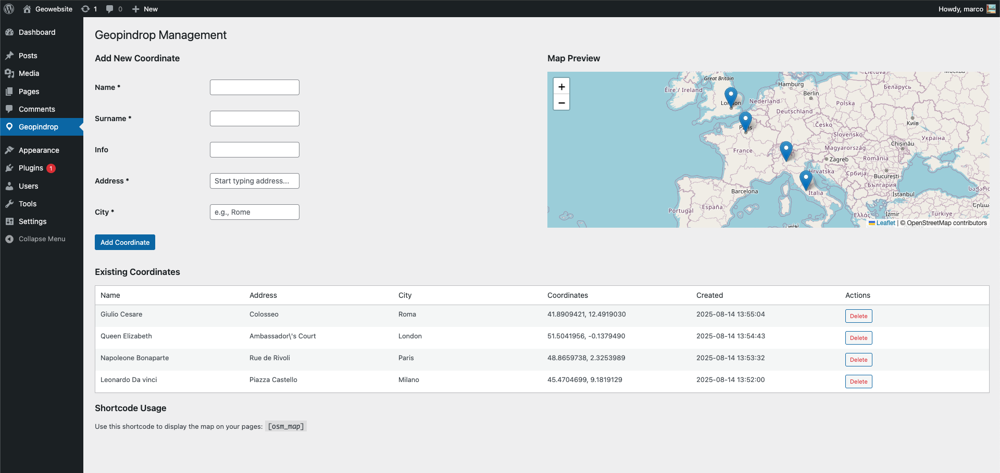
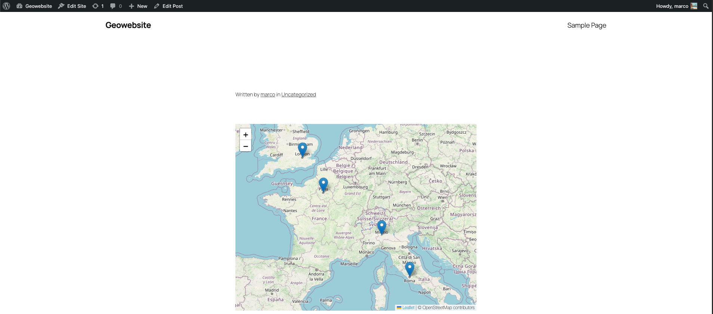

# Geopindrop Wordpress Plugin

## Introduction
Geopindrop is a WordPress plugin that makes it easy to manage and display geographic locations using OpenStreetMap. It automatically converts addresses into precise coordinates through the OpenStreetMap Nominatim service, offering a seamless workflow for administrators and an engaging interactive map for visitors. With built-in autocomplete, an admin map preview, and a simple shortcode, it provides both simplicity and flexibility for location-based content.

## Description
The plugin integrates directly into your WordPress admin dashboard, allowing you to add new locations simply by entering a name, address, and city. As you type, the plugin suggests possible matches and, once confirmed, automatically transforms the address into latitude and longitude coordinates. All saved locations appear on an interactive map preview within the admin interface, making it easy to verify and adjust entries.  

On the public-facing side, the `[osm_map]` shortcode displays an interactive, responsive map with all stored coordinates. Visitors can explore the map, click markers for detailed pop-ups, and view the optimal zoom level to fit all locations. Whether for business listings, events, or personal projects, the plugin offers an efficient way to present location data in a visually appealing format.

### Technologies Used
- <a href="https://nominatim.openstreetmap.org/" >OpenStreetMap Nominatim</a> – Geocoding service to convert addresses into coordinates.
- <a href="https://leafletjs.com/">Leaflet.js</a> – Lightweight JavaScript library for interactive maps.

## Getting started
1. clone the repo and start docker container:
```bash
git clone https://github.com/yourusername/geopindrop-plugin.git
cd geopindrop-plugin
docker-compose up -d
```
2. Go to *Admin → Geopindrop*, fill in the details, and let the plugin auto-generate coordinates.  
3. Insert the `[osm_map]` shortcode into any page or post to display your map.

**Installation**
1. Upload the `geopindrop-plugin` folder to `/wp-content/plugins/` or install via the WordPress admin panel.  
2. Activate it under *WordPress Admin → Plugins*.

## Result


